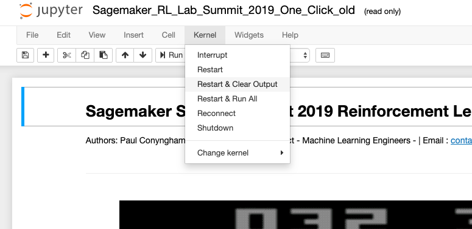

# **Turbocharging Reinforcement Learning with SageMakerRL**
--
**Authors :** Paul Conyngham & William Xu | StarAi Project Machine Learning Engineers - | Email : contact@starai.com

This lab is provided as part of [Dev Day Online](https://github.com/aws-john/dev-day-labs).

ℹ️ You will run this lab in your own AWS account. Please follow directions at the end of the lab to remove resources to minimize costs.

This workshop shows you how, using AWS, you can parallelise the training of your reinforcement learning algorithms to get insanely fast turn around times and results for your reinforcement learning experiments.

# Instructions

## Setup: Launch AWS CloudFormation Stack

You will use AWS CloudFormation to deploy Amazon SageMaker in your AWS account. It will be deployed in the us-east-1 (N. Virginia) region. Please ensure you follow directions at the end of the lab to delete the CloudFormation stack to remove resources.

**1.** Login to your AWS account.

**2.** Right-click this link and open in a new browser tab: [Launch Stack into us-east-1 with CloudFormation](https://console.aws.amazon.com/cloudformation/home?region=us-east-1#/stacks/new?stackName=SageMakerRLLabSummitSydney2019&templateURL=https://s3-ap-southeast-2.amazonaws.com/aws-summit-2019-rl/AWS-summit_RL-CloudFormation.yml)

The CloudFormation console will be displayed, with some information already entered.

**3.** Click **Next** three times.

**4.** At the bottom of the page, select "I acknowledge that AWS CloudFormation might create IAM resources".

**5.** Click **Create stack**.

This will launch an Amazon SageMaker notebook instance.

## Access SageMaker

**6.** In the **Services** menu, select **SageMaker**.

**7.** In the left menu under **Notebook**, click **Notebook instances**.

**8.** In the line for **BasicNotebookInstance**, click **Open Jupyter**.

A new tab will open, showing the jupyter notebook.

**9.** Click **Summit-RL**.

Wait for the page to fully load.

**10.** Click **Sagemaker_RL_Lab_Summit_2019_One_Click.ipynb**.

A new browser tab will open and launch a Jupyter notebook.

**11.** In the top-right, click **Not Trusted**, then click **Trust**.

**12.** In the **Kernel** menu, click **Restart & Clear Output** and then click the red button that appears.

You are now ready to get started with the lab!

In some rare cases, the Jupyter notebook might ask which kernel to use. If this happens, select _conda_tensorflow_p36_.

The rest of the workshop continues in the Jupyter notebook. Follow the instructions there to continue to learn about distributed Reinforcement Learning with Sagemaker RL. **When the lab is finished, please use the instructions below to clean-up resources so that you stop charges being incurred.**

## Important: Clean-up

When you have completed the lab, you must delete the CloudFormation stack as follows:

**13.** Return to the AWS console and use the **Services** menu to go to **CloudFormation**.

**14.** Select the CloudFormation stack (click the cirle).

**15.** Click **Delete**.

This will delete the stack and will stop charges being incurred in your AWS account.
